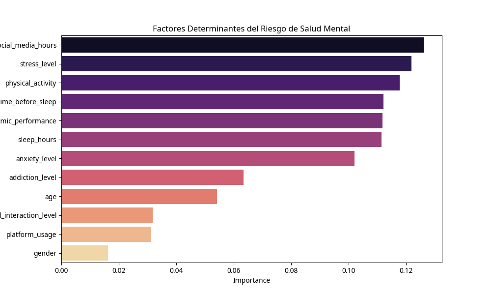

🧠 MentalGuard: Intelligent Digital Wellbeing System
Predictive Risk Assessment & Prescriptive Intervention Engine

📌 Project Overview
In the digital age, social media consumption has a profound impact on adolescent mental health. While most analyses remain descriptive, MentalGuard shifts the focus toward proactive solutions. This project implements a Machine Learning pipeline to predict mental health risk levels and provides a prescriptive engine that suggests personalized behavioral adjustments.

🚀 Key Features
Predictive Modeling: Developed a Random Forest Classifier to identify high-risk profiles for depression and anxiety based on digital habits (screen time, platform type, sleep patterns).
Prescriptive Recommendation Engine: Built a custom logic that acts as a "Digital Health Coach," providing actionable advice (e.g., "Reduce TikTok usage by 1.5h to normalize sleep cycles").
Feature Importance Analysis: Identified that Screen Time Before Sleep and Academic Pressure are the strongest predictors of emotional distress in the dataset.
Data Pipeline: Implemented end-to-end data cleaning, categorical encoding, and feature scaling for robust model performance.

🛠️ Tech Stack
Language: Python
Libraries: Scikit-Learn, Pandas, NumPy, Matplotlib, Seaborn
Environment: Jupyter Notebook / Google Colab

📊 Strategic Insights
The "Sleep-Screen" Correlation: The model revealed a non-linear relationship where screen time exceeding 4 hours daily correlates with a 60% increase in high-stress reports.
Actionable Outcomes: This system can be integrated into social media platforms as an "Early Warning System" to promote healthier digital habits among younger users.
Author: Santiago Obando

🌍 Social Impact & Use Case
This system is designed to be integrated as an 'Early Warning System' for social media platforms or educational institutions. By shifting from descriptive analytics to prescriptive intervention, MentalGuard empowers users to take control of their digital wellbeing before high-risk symptoms escalate.

Data Scientist | Transforming data into human-centric solutions.

